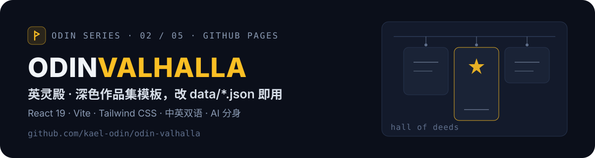

<p align="center">
  
</p>

<p align="center">
  <a href="https://kael-odin.github.io/odin-valhalla/"></a>
  <a href="https://github.com/kael-odin/odin-valhalla/actions/workflows/ci-cd.yml"></a>
  
  
  
  
</p>

## ✨ 这是什么

一个深色开发者作品集模板（React 19 + Vite 8 + Tailwind CSS v4）：近黑画布、单一蓝色强调族、极简描边卡片、极光氛围背景。**默认中文、右下角一键切英文**，本站本身就是用 Kael Odin 真实信息打磨的活示例。衍生自 [Sagargupta16/portfolio-react](https://github.com/Sagargupta16/portfolio-react)（GPL-3.0），已去个性化为占位模板——改 `data/*.json` 就能变成你的。

| Hero（中文） | Projects（English） |
| --- | --- |
|  |  |
| **在线简历预览** | **AI 分身** |
|  |  |

## 🌟 亮点

- **双语数据驱动**：内容在 `data/*.zh.json` / `data/*.en.json`（校验器强制中英 id 集合一致），界面文案在 `src/i18n/`
- **在线简历预览**：首屏「查看简历」弹窗内嵌金山文档 / WPS 分享链接，完整查看器站内可用
- **AI 分身**：右下角悬浮聊天窗，接你自己的 OpenAI 兼容网关；密钥只放后端（Vercel Serverless `api/chat.js` 已内置），未配置时给出明确指引不静默失败
- **动效可访问**：Full / Reduced 动效偏好持久化，切换时保留草稿、筛选与焦点
- **质量守门**：strict TypeScript + 22 个 Vitest 测试 + JSON schema 校验 + 零警告 ESLint，CI 全部强制

## 🚀 快速开始

```bash
git clone https://github.com/kael-odin/odin-valhalla.git
cd odin-valhalla
pnpm install        # 要求 pnpm ≥ 11, Node ≥ 24.11
pnpm dev            # http://localhost:3000
pnpm build          # 校验数据 + 构建到 build/
```

文件地图、编辑配方与贡献检查见 [CONTRIBUTING.md](CONTRIBUTING.md)。

## 🎨 改成你自己的

按这个顺序替换 `data/` 下的内容（`pnpm validate:data` 全程把关）：

**`personal.*.json`**（名字/社交）→ **`contact.json`**（链接 + EmailJS）→ **`experience.*.json`** → **`projects.*.json`**（+ 封面注册）→ **`achievements.*.json`**（徽章/统计）→ **`services.*.json`** → `src/i18n/` 界面文案 → `index.html`（标题/meta）。

## 🤖 启用 AI 分身（生产）

站点静态托管时聊天后端单独部署：把本仓库导入 Vercel（`api/chat.js` 自动成为 Serverless 函数），环境变量配网关四件套（`OPENCLAW_CHAT_URL` / `OPENCLAW_API_KEY` / `OPENCLAW_MODEL` / `OPENCLAW_MAX_TOKENS`）即可，前端自动走同源 `/api/chat`。详见 [`docs/AI助手接入说明.md`](docs/AI助手接入说明.md)。

## 🌐 部署

推送 `main` 走 GitHub Actions CI/CD 发布到 GitHub Pages（vite base 按仓库名自动注入）。导入 Vercel 同样开箱即用（`vercel.json` 已配好构建与函数）。

## 🧭 Odin 系列

| 符 | 仓库 | 定位 | 访问 |
| --- | --- | --- | --- |
| 🌈 | [odin-bifrost](https://github.com/kael-odin/odin-bifrost) | 个人作品集主站（Next.js Bento） | [live](https://kael-odin.github.io/odin-bifrost/) |
| ⚡ | **odin-valhalla** | 深色作品集模板（React + Vite） | 这里 |
| 🗿 | [odin-runestone](https://github.com/kael-odin/odin-runestone) | 双语作品集模板（Vite + GSAP） | [live](https://kael-odin.github.io/odin-runestone/) |
| 📜 | [odin-saga](https://github.com/kael-odin/odin-saga) | 博客与数字花园（Next.js） | [live](https://odin-saga.vercel.app/) |
| 🏠 | [odin-heim](https://github.com/kael-odin/odin-heim) | OS 风互动主页模板（Vite） | [live](https://kael-odin.github.io/odin-heim/) |

> 同一套北欧神话命名 `odin-<词根>`，词根即职能：彩虹桥是入口，英灵殿陈列功绩，卢恩石碑刻生平，萨迦记事，heim 是家。

## 📄 许可

[GPL-3.0](LICENSE)（继承自原项目 [Sagargupta16/portfolio-react](https://github.com/Sagargupta16/portfolio-react)）。若基于本模板建站，请保留原项目与本仓库的署名。

---

<p align="center"><sub><b>ODIN SERIES</b> · bifrost / valhalla / runestone / saga / heim · crafted by <a href="https://github.com/kael-odin">Kael Odin</a></sub></p>
